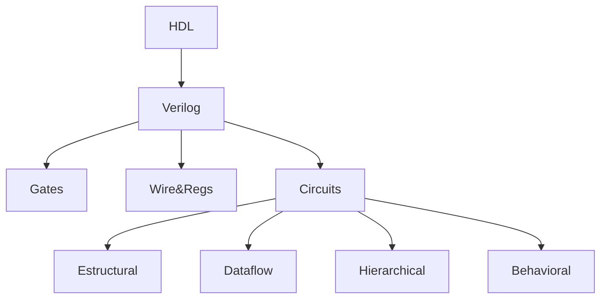
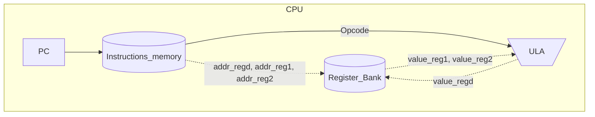
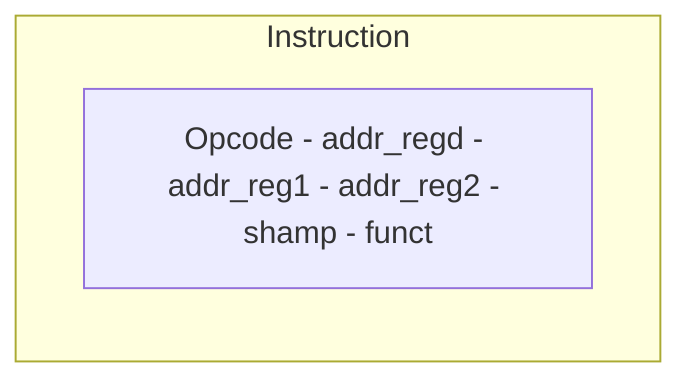
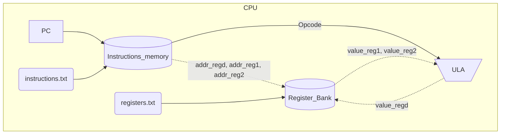

# Linguagem de descrição de hardware

- Neste projeto pretendo apresentar a linguagem de descrição **verilog** para descrever sistemas digitais




## Projetos RTL
- [Multiplicação Sequencial](https://github.com/petrucior/verilog/blob/main/maquinaMultiplicacao.ipynb)
    - Descrição: A máquina de multiplicação sequencial será inicializada com **st** (1 bit) e alimentada com A e B (ambos com 4 bits). A multiplicação entre A e B será conduzida através de um somador e sua resposta armazenada em 8 bits (R). Para isso, A será somado B vezes (veja exemplo abaixo). Além disso, na especificação dessa máquina temos um bit (op) responsável para informar se a máquina está em operação. 

        ```
        Se A = 4 e B = 3, temos:
        (1) A + A + A = 4 + 4 + 4 = 12
        (2) B + B + B + B = 3 + 3 + 3 + 3 = 12
        ```
- [Processador simplificado](https://github.com/petrucior/verilog/blob/main/processador.ipynb)


   - Descrição: Neste projeto foi considerado um contador de programa (PC), uma memória de instruções que contém 100 endereços e cada endereço com 32 bits. Um banco de registradores com 32 endereços de 32 bits previamente definido com os endereços 0 e 1 preenchidos com os valores 3 e 5, respectivamente. Uma unidade lógica aritmética (ULA) para realizar a operação de soma. Finalmente, uma Unidade Central de Processamento (CPU) para coordenar as operações entre essas unidades.

         As instruções são codificadas da seguinte forma:
             Opcode : 6 bits
             Registrador destino : 5 bits
             Registrador fonte 1 : 5 bits
             Registrador fonte 2 : 5 bits
             Shamp ( operações de deslocamento ) : 5 bits
             Funct ( variacoes das operacoes especificadas do opcode ) : 6 bits
            


- [Processador simplificado (versão 2)](https://github.com/petrucior/verilog/blob/main/processador_v2.ipynb)


   - Descrição: Neste projeto consideramos o Processador simplificado implementado acima e adicionamos um operador de subtração e uma configuração automática de instruções e valores para o banco de registradores por meio da leitura de arquivos .txt.
