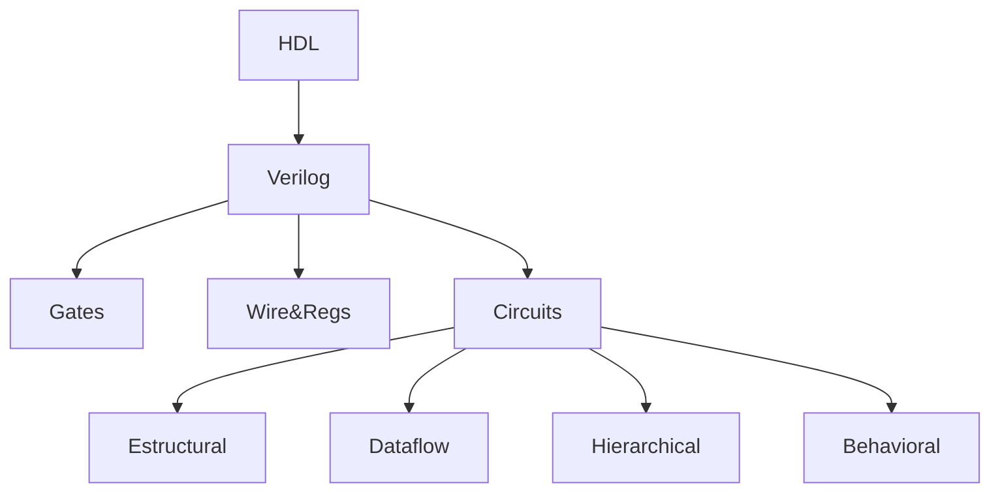

Linguagem de descrição de hardware

- Neste projeto pretendo apresentar a linguagem de descrição **verilog** para descrever sistemas digitais

```mermaid
graph TD;
    HDL --> Verilog;
    Verilog --> Gates;
    Verilog --> Wire&Regs;
    Verilog --> Circuits;
    Circuits --> Estructural;
    Circuits --> Dataflow;
    Circuits --> Hierarchical;
    Circuits --> Behavioral;
```
