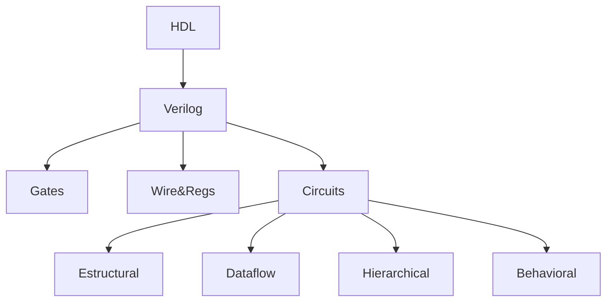

# Linguagem de descrição de hardware

- Neste projeto pretendo apresentar a linguagem de descrição **verilog** para descrever sistemas digitais




## Projetos RTL
- Multiplicação Sequencial
    - Descrição: A máquina de multiplicação sequencial será inicializada com **st** (1 bit) e alimentada com A e B (ambos com 4 bits). A multiplicação entre A e B será conduzida através de um somador e sua resposta armazenada em 8 bits (R). Para isso, A será somado B vezes (veja exemplo abaixo). Além disso, na especificação dessa máquina temos um bit (op) responsável para informar se a máquina está em operação. 

        ```
        Se A = 4 e B = 3, temos:
        (1) A + A + A = 4 + 4 + 4 = 12
        (2) B + B + B + B = 3 + 3 + 3 + 3 = 12
        ```
